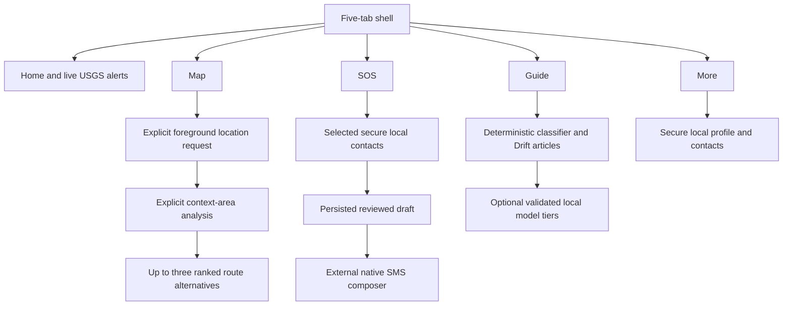

# Context-Aware Mobile Flow

## Scope

The Android client uses explicit user actions, foreground location, network
results, cache availability, and local configuration to select honest UI states.
It never activates SOS, shares location, or requests navigation automatically.

Text fallback: the five shell branches expose live alerts, explicit location and
simulation navigation, local SOS preparation, offline guidance, and local
profile/contact management. Riverpod controllers convert permission, provider,
cache, secure-storage, and optional-model outcomes into visible states.

## Location And Navigation

1. The Map tab starts at `notRequested`; it does not prompt on app launch.
2. **Use my location** checks services and foreground permission, requesting
   permission only when currently denied.
3. The controller reports precise, approximate, denied, permanently denied,
   service disabled, recoverable error, or a timestamped last-known fallback.
4. Once a location exists, hazards load from the backend. A user action is
   required before the exact origin is sent for context-area analysis. Remote
   failure falls back to matching cached data when available.
5. A valid `MAPBOX_PUBLIC_ACCESS_TOKEN` enables map rendering. Missing/invalid
   configuration does not hide the location or route controls.
6. The user chooses a disaster type and explicitly analyzes nearby areas.
   Earthquake analysis is limited to outdoors after shaking; flood analysis
   compares simulated elevation and flood exposure.
7. The user selects a generated lower-exposure area and explicitly requests
   route alternatives.
8. The backend requests up to three Mapbox alternatives and ranks them by
   relevant simulated hazard intersections, duration, then distance. The user
   can select any returned option.

`ENABLE_SIMULATION_DATA` is false by default and forbidden in production. All
shelters, hazards, and routes are fictional, timestamped, attributed, labeled
SIMULATION, and uncertain. A cached route is not recomputed for a changed
location and is shown only with a cache warning after remote failure.

## Alerts And Offline State

The alert repository watches Drift before refreshing the API. Current cache
content remains visible during refresh. A successful response, including an
empty list, replaces the cached snapshot transactionally. A provider, protocol,
network, or storage failure preserves valid saved records and marks them stale;
failure before any successful snapshot is unavailable rather than empty.

The backend current/stale threshold is five minutes from the last successful
USGS refresh. Mobile and backend timestamps remain visible so users can judge
age. The coarse Myanmar coverage box is not an affected-area or safety boundary.

## SOS And Local Profile

Profile and contact data are stored in Android secure storage and are not
uploaded. Contacts become SOS recipients only after explicit selection. The SOS
screen previews recipients, body, profile name, and current/last-known location
before confirmation.

Confirmation first persists a secure local draft, then hands a prefilled `sms:`
URI to an external messaging app. The only observable handoff states are
prepared, composer opened, failed to open, and cancelled. SafeMyanmar does not
send the SMS and has no sent, delivered, dispatch, or rescue acknowledgement.

## Guide And Assistant

Drift v3 seeds a small versioned English/Myanmar Guide set with trusted source
metadata and review dates. Search, category filtering, and deterministic intent
matching work offline. The deterministic tier always controls approved article
retrieval and explicit map/SOS navigation actions.

Optional ONNX refinement runs only for an unknown deterministic result. Optional
LiteRT-LM can only reword supplied verified content and is excluded from
critical intents. Missing, invalid, unsupported, resource-constrained, or failed
models fall back without blocking deterministic guidance. See
[optional AI model provisioning](optional-ai-model-provisioning.md).

## Privacy And Permission Boundaries

- Android requests Internet and foreground coarse/fine location only.
- There is no background location, contacts, SMS-send, call, camera, microphone,
  notification, storage, or model-download permission in the implemented flow.
- Exact route origin is sent to the configured backend only when the user
  requests a route. The backend does not persist or log route coordinates.
- No action is inferred from movement, alert severity, or assistant text.
- Profile/contact/SOS records stay in secure local storage; operational caches
  and Guide content stay in app-private Drift storage.
