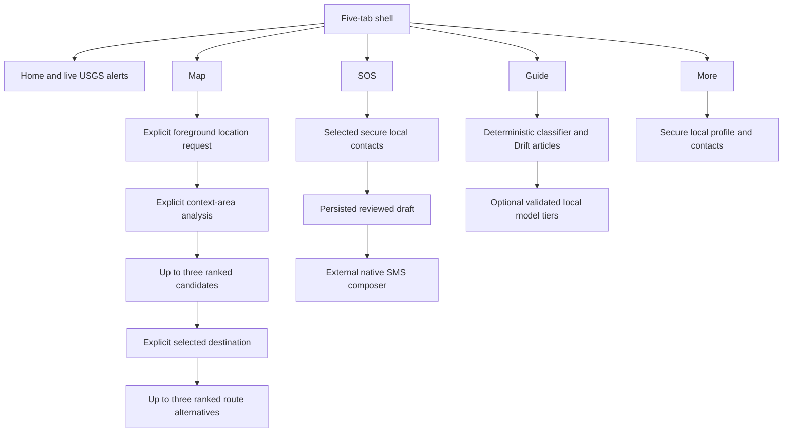

# Context-Aware Mobile Flow

## Scope

The Android client uses explicit user actions, foreground location, network
results, cache availability, and local configuration to select honest UI states.
It never activates SOS, shares location, or requests navigation automatically.
An explicitly enabled Android background SOS receiver may scan for validated
nearby BLE frames, show an unverified notification, and retain the frame for
later display; it does not relay or upload in the background.

Text fallback: the five shell branches expose live alerts, explicit location and
simulation navigation, local SOS preparation, offline guidance, and local
profile/contact management. Riverpod controllers convert permission, provider,
cache, secure-storage, and optional-model outcomes into visible states.

Home exposes large Safety Center cards for alerts, Map, SOS setup, and Guide.
They navigate only and never activate location, SMS, or Bluetooth by
themselves. SOS retains an explicit setup, exact preview, and confirmation
sequence; Guide quick actions open only curated content or an explicit route.

## Location And Navigation

1. The Map tab starts at `notRequested` and does not show a system permission
   prompt on app launch. If the user previously selected **Use my location** and
   OS permission is still granted, the controller restores the current location
   without asking again.
2. **Use my location** checks services and foreground permission, requesting
   permission only when currently denied. A successful grant is stored so later
   launches can restore location without repeating the in-app prompt.
3. The controller reports precise, approximate, denied, permanently denied,
   service disabled, recoverable error, or a timestamped last-known fallback.
4. Once a location exists, hazards load from the backend. A user action is
   required before the exact origin is sent for context-area analysis. Remote
   failure falls back to matching cached data when available.
5. A valid `MAPBOX_PUBLIC_ACCESS_TOKEN` enables map rendering. Missing/invalid
   configuration does not hide the location or analysis flow. The map claims
   gestures from the surrounding scroll view so it can be panned, zoomed, and
   rotated directly. A Waze-inspired floating location action recenters the
   map; tapping it or the user marker opens a detail sheet with precision,
   coordinates, and capture time. A visible-layer legend pairs marker colors
   with icons and labels.
6. The user taps **Analyze nearby areas**. Once the nearby-area analysis is
   requested, disaster type, earthquake scenario, travel profile, and route
   controls become available. Changing an analysis input clears the previous
   result but keeps these controls visible for the next explicit analysis.
   Earthquake analysis is limited to outdoors after shaking; flood analysis
   compares terrain elevation and current hazard exposure. In the optional
   backend-only `ENABLE_SIMULATION_ANALYSIS` mode, fictional hazard geometry may
   be added to that calculation, but the response labels the mixed sources and
   the mobile hazard and shelter lists remain collected-data-only.
   Plain-language summaries expose the selected result's typed metrics,
   rationale, source, timestamp, cached state, and uncertainty without claiming
   an official shelter or guaranteed safety.
   The client preserves the API's explicit `simulation` marker instead of
   inferring it from source text; fictional or mixed analysis is displayed only
   when the mobile development simulation gate is enabled.
7. The UI displays up to three generated candidates and the user explicitly
   selects one. The selected context-area ID is sent in both the compatibility
   `shelter_id` field and `context_area_id`; no route request is made from a
   merely displayed or inferred candidate.
8. The backend recomputes and validates the selected destination, then requests
   up to three Mapbox alternatives. Real routes are ranked by current mapped
   hazard intersections, duration, then distance; simulation routes use the
   same deterministic ordering against fictional hazards. The user can select
   any returned option, but none is presented as guaranteed safe.
9. Route cards retain the destination source, directions provider, profile,
   `generated_at`, `hazard_data_at`, ranking rationale, simulation marker, and
   uncertainty notice. Missing Mapbox credentials, empty or invalid provider
   results, stale navigation data, or an unverified destination leave routing
   unavailable rather than triggering a straight-line fallback.

`ENABLE_SIMULATION_DATA` is false by default and forbidden in production. All
shelters, hazards, and routes in that mode are fictional, timestamped,
attributed, labeled SIMULATION, and uncertain. `ENABLE_SIMULATION_ANALYSIS` is
also false by default and forbidden in production; it only augments backend
context analysis and must never silently replace or merge the mobile hazard or
shelter lists. A cached route is not recomputed for a changed location and is
shown only with a cache warning after remote failure.

## Nearby-area environment pipeline

Real earthquake analysis asks the backend environment provider for full
OpenStreetMap geometry through Overpass: named parks, sports fields, recreation
grounds, public squares, designated gathering areas, building footprints and
heights, trees or woodland, and power infrastructure. Real flood analysis
enables mapped water, wetland, and waterway geometry and samples terrain at a
denser local grid. The default configured elevation service is OpenTopoData
ASTER30m; a deployment can substitute a compatible approved DEM or
Copernicus-derived service through `ELEVATION_API_URL`. Terrain elevation is
not a flood forecast or an authority-verified vertical-evacuation site.

The backend keeps observations in a bounded, process-local coarse cache keyed
by rounded analysis cells and request options. It retains up to 128 entries for
five minutes, does not write GIS observations to the database, and may return a
matching expired observation with an explicit stale notice when a provider
fails. The original observation timestamp remains visible. Exact user
coordinates are not logged or persisted by SafeMyanmar, although the requested
location is sent to the configured upstream GIS services during collection.
Mapped data can be incomplete or stale: absent OSM geometry is not confirmation
of absence, and missing building heights or partial geometry lower confidence.
User-facing OSM-derived content must include `© OpenStreetMap contributors` and
respect the configured elevation provider's terms.

The response remains a comparative lower-exposure suggestion. It is not a
survey, official shelter, evacuation order, flood warning, or guarantee of a
safe place or route. A future preprocessed Myanmar GeoJSON/DEM adapter can
replace the public provider while preserving the API and mobile states.

## Background SOS Receiving

1. The SOS screen exposes a separate opt-in for Android background receiving.
   Foreground receiving and relay remain independent controls.
2. Enabling it requests nearby-device and notification permissions, then starts
   a connected-device foreground service with an ongoing notification.
3. The service validates the BLE marker, protocol version, length, checksum,
   timestamp, TTL, hop count, battery, and coordinates before accepting a
   frame. It encrypts a bounded app-private queue and deduplicates event IDs.
4. A new accepted frame produces an unverified notification without placing
   exact coordinates in notification text. The frame is not relayed or
   uploaded by the service.
5. When the app resumes, Flutter hydrates unexpired frames. A notification tap
   opens `/map`; when the frame includes coordinates, the map adds the
   unverified marker and focuses it. Without coordinates, the event remains in
   the SOS list but cannot be plotted.
6. Android may stop the service after force-stop, Bluetooth disablement,
   permission revocation, or OEM battery policy. The UI must continue to label
   the receiver as best-effort rather than continuous coverage.

## Alerts And Offline State

The alert repository watches Drift before refreshing the API. Current cache
content remains visible during refresh. A successful response, including an
empty list, replaces the cached snapshot transactionally. A provider, protocol,
network, or storage failure preserves valid saved records and marks them stale;
failure before any successful snapshot is unavailable rather than empty.

The backend current/stale threshold is five minutes from the last successful
USGS refresh. Mobile and backend timestamps remain visible so users can judge
age. The coarse Myanmar coverage box is not an affected-area or safety boundary.

## SOS And Local Profile

Profile and contact data are stored in Android secure storage and are not
uploaded. Contacts become SOS recipients only after explicit selection. The SOS
screen previews recipients, body, profile name, and current/last-known location
before confirmation.

Confirmation first persists a secure local draft, then requests `SEND_SMS` and
invokes Android `SmsManager`. Observable states include prepared, sending,
device-accepted, failed, and cancelled. Device acceptance is not carrier
delivery, and SafeMyanmar has no dispatch or rescue acknowledgement.

## Guide And Assistant

Drift v3 seeds a small versioned English/Myanmar Guide set with trusted source
metadata and review dates. Search, category filtering, and deterministic intent
matching work offline. The deterministic tier always controls approved article
retrieval and explicit map/SOS navigation actions.

Optional ONNX refinement runs only for an unknown deterministic result. Optional
LiteRT-LM can answer general non-critical questions and reword supplied verified
content, with approved disaster context supplied when relevant. It is excluded
from critical intents. Missing, invalid, unsupported, resource-constrained, or
failed models fall back without blocking deterministic guidance. See
[optional AI model provisioning](optional-ai-model-provisioning.md).

## Privacy And Permission Boundaries

- Android requests Internet, foreground coarse/fine location, and SMS-send only
  after explicit SOS confirmation.
- There is no background location, contacts, call, camera, microphone, or
  model-download permission in the implemented flow. Notification permission
  is requested only when Bluetooth SOS receiving or sharing is explicitly
  enabled; background receiving also uses the connected-device foreground
  service permission.
- Exact route origin is sent to the configured backend only when the user
  requests a route. The backend does not persist or log route coordinates.
- No action is inferred from movement, alert severity, or assistant text.
- Profile/contact/SOS records stay in secure local storage; operational caches
  and Guide content stay in app-private Drift storage.
