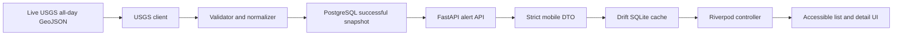

# Live Earthquake Slice Architecture

## Scope

This document isolates the implemented live-earthquake subsystem: an Android
Flutter client backed by FastAPI and PostgreSQL that displays USGS observations
within an approximate Myanmar coverage box and persists them on server and
device. The wider app also implements foreground location, opt-in fictional
SIMULATION navigation, local SOS drafts, offline Guide content, constrained
assistance, and secure local profile/contact storage. Those features are covered
in [the context-aware mobile flow](context-aware-mobile-flow.md).

The alert subsystem itself does not provide warnings, prediction, severity,
authentication, notifications, or simulated earthquake records.

The inclusive coverage bounds are latitude `8.284` to `30.043` and longitude
`90.689` to `102.676`. They include a coarse 1.5-degree border buffer. They are
not a political border, affected-area calculation, or statement that locations
outside the box are safe.

## Data Flow

Text fallback: the backend retrieves the live USGS feed, validates each feature,
normalizes in-bounds observations, reconciles a successful snapshot in
PostgreSQL, and exposes it through the alert API. The mobile client strictly
decodes that API, transactionally stores it in Drift, derives Riverpod state,
and renders the list/detail UI.

## Refresh And Reconciliation

`GET /api/v1/alerts` may initiate a provider refresh. A PostgreSQL transaction
advisory lock serializes competing refreshes across API processes. The provider
is attempted no more often than every 60 seconds. A successful valid response,
including an empty feature collection, upserts newer provider revisions, removes
USGS rows absent from that snapshot, and records the successful retrieval time.
An older provider revision cannot overwrite a newer stored row.

Provider timeout, HTTP failure, or invalid top-level payload records a safe error
code but does not reconcile or erase the last successful snapshot. Detail reads
use PostgreSQL only and never trigger provider retrieval.

## Current And Stale Boundaries

The backend marks a snapshot `current` when its last successful refresh is no
more than five minutes old; older successful data is `stale`. If no successful
refresh exists and USGS cannot be reached, the API returns a safe `503` rather
than a reassuring empty list.

The mobile repository watches Drift before requesting the API. A successful API
response replaces cache metadata and records transactionally. While refreshing,
saved records remain visible as cached. A network, protocol, or storage failure
never blanks valid saved records; Riverpod marks them stale and shows that live
information could not be updated. A successful empty response remains distinct
from failure and cautions that no result does not guarantee no danger.

## Configuration And Transport

The earthquake provider default is the production USGS all-day feed. The
controlled `integration-fixture` provider is under `backend/tests/fixtures/`, is
started only by test tooling, and is never imported or referenced by
`backend/app` or `mobile/lib`. Separately, runtime shelter, hazard, and route
records are fixed fictional data behind `ENABLE_SIMULATION_DATA`, which defaults
to false and is forbidden in production. They never enter the alert tables or
alert API.

Release API endpoints must use HTTPS, and main/release Android configuration has
no cleartext exception. The controlled debug integration path is separate: an
emulator reaches the host API at `10.0.2.2:8000`, while a physical device uses
`localhost` or `127.0.0.1` with an explicit device-side port mapped to host port
8000 by `adb reverse`. Android debug network policy permits cleartext only for
these local hosts. The integration harness rejects remote hosts and never uses
its `-ApiBaseUrl` option to contact a remote API.

## Security And Privacy

The alert flow needs Internet access and stores provider observations plus sync
timestamps, not user location or personal data. The wider Android app also
declares coarse/fine foreground location; it declares no background location,
SMS-send, call, camera, microphone, contacts, notification, or model-download
permission. Profile/contact/SOS records use secure local storage, while map and
Guide caches use app-private Drift storage.

Database credentials and the Mapbox Directions secret come from backend local
environment configuration; real `.env` files are ignored. The optional mobile
`MAPBOX_PUBLIC_ACCESS_TOKEN` is a restricted public compile-time token and must
never be replaced with the backend secret.

USGS observations are informational and preliminary values may change. They are
not official Myanmar warnings, earthquake predictions, complete all-disaster
coverage, affected-area assessments, or guarantees of safety.
