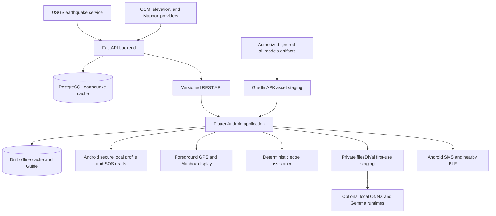

# SafeMyanmar Presentation

## Accuracy Scope

This presentation describes the repository implementation as of September 8,
2026. It distinguishes shipped behavior from optional capability, the public
fictional simulation mode, and future work.

| Status | Meaning |
|---|---|
| Implemented | Present in the current Android or backend code |
| Partial or optional | Implemented with data, configuration, supported hardware, or authorized model artifacts and build packaging required |
| Simulation | Fictional, clearly labeled data available through the public Render demonstration or local opt-in |
| Future | Proposed capability that is not implemented |

---

## Slide 1 - Title

# SafeMyanmar

## AI Context-Aware Disaster Response Mobile Application

**Academic Android disaster-information prototype**

SafeMyanmar explores how mobile and ubiquitous computing can support people
before, during, and after disasters while preserving explicit consent, source
provenance, offline access, and visible uncertainty.

The current project combines:

- Mobile Computing
- Ubiquitous and Context-Aware Computing
- Foreground GPS
- On-device Edge Computing
- A FastAPI and PostgreSQL server layer
- Deterministic assistance with optional local AI models

High Performance Computing is a future research direction, not part of the
implemented application.

---

## Slide 2 - Project Overview

Disasters can make reliable information, communication, and local guidance
difficult to access. SafeMyanmar investigates these problems through one
Android application.

The implemented prototype focuses on:

- Live USGS earthquake observations for Myanmar and a nearby coverage buffer
- Explicit foreground location and context-aware map functions
- Source-backed, lower-exposure area analysis and optional route suggestions
- Confirmed SOS preparation through SMS and nearby Bluetooth
- Versioned offline emergency guidance
- Deterministic assistance with optional on-device model tiers

SafeMyanmar is not an official warning, prediction, dispatch, medical, or
guaranteed-safety service.

---

## Slide 3 - Problem Statement

People may face several information and communication problems during a
disaster.

**Unverified information**

Social media and unofficial messages can spread incomplete or misleading
claims.

**Limited route information**

Road access, hazards, shelter availability, and local conditions can be unknown
or change quickly.

**Difficult emergency communication**

An injured or trapped person may need a short way to share a prepared message
and last available location with selected contacts.

**Unreliable connectivity**

Cloud services and live data may be unavailable when network connectivity is
poor.

**Generic assistance**

General information may not account for the user's location, permissions,
available data, or selected disaster context.

---

## Slide 4 - Project Objectives

The implemented project objectives are to:

- Retrieve, validate, store, and display live USGS earthquake observations
- Preserve cached observations and clearly identify live, cached, stale, empty,
  and unavailable states
- Request foreground location only after an explicit user action
- Provide source-backed nearby analysis without guaranteeing that an area or
  route is safe
- Let users prepare and confirm SOS communication for selected contacts
- Keep reviewed emergency guidance available offline
- Demonstrate explainable and privacy-conscious context-aware behavior
- Explore optional local AI without allowing it to control critical emergency
  actions

Reducing real-world rescue time and integrating with rescue organizations are
future evaluation and integration goals; they have not been demonstrated by
the prototype.

---

## Slide 5 - Target Users

**Current primary users**

- Citizens who need earthquake information, offline guidance, or local SOS
  preparation
- Families and trusted contacts who may receive a user-confirmed SMS
- Students and evaluators studying mobile and ubiquitous computing concepts

**Future stakeholders**

- Volunteers
- Rescue teams
- Humanitarian organizations
- Government disaster-management organizations

The current application does not provide an authenticated rescue-team or
organization portal, dispatch workflow, or family-location tracking service.

---

## Slide 6 - Implemented Feature Scope

| Capability | Current status |
|---|---|
| Live USGS earthquake information | Implemented |
| Foreground GPS and cache-aware map UI | Implemented |
| Nearby context analysis and Mapbox route alternatives | Partial and data-dependent |
| Secure local profile and emergency contacts | Implemented |
| Confirmed direct-SMS SOS preparation | Implemented on Android |
| Nearby Bluetooth SOS broadcast and receiving | Implemented on supported Android devices |
| Offline Guide and deterministic assistant | Implemented |
| Optional local ONNX and Gemma models | Implemented runtime, build-time asset staging, and first-launch private provisioning |
| Fictional navigation records | Publicly labeled simulation mode in the Render blueprint |
| Rescue Beacon flashlight, siren, and HELP screen | Future |
| Multi-disaster live alerts, trusted report submission, and damage reporting | Future |
| Cloud AI, push notifications, rescue dispatch, and HPC processing | Future |

---

## Slide 7 - Live Earthquake Information

SafeMyanmar retrieves earthquake observations from the USGS FDSN service
through the backend.

- Coverage includes epicentres inside Myanmar or approximately 100 km from the
  simplified national outline
- The backend searches a ten-year window and returns up to ten recent matching
  records
- Each item includes magnitude, depth, coordinates, event time, provider update
  time, retrieval time, review status, and a trusted USGS link
- PostgreSQL stores the successful server snapshot
- Drift stores the latest mobile snapshot for offline display
- The UI distinguishes live, cached, stale, empty, and unavailable information

These are preliminary earthquake observations, not earthquake predictions,
official Myanmar warnings, severity assessments, or evacuation orders. The
runtime has no live flood, fire, cyclone, landslide, or severe-weather alert
feed.

---

## Slide 8 - Foreground GPS and Route Suggestions

SafeMyanmar requests foreground location only when the user chooses to use it.

The implemented flow can consider:

- Precise, approximate, current, or last-known foreground location
- Current records from the configured validated navigation snapshot
- Explicitly requested OpenStreetMap environment analysis
- Terrain elevation for supported flood analysis
- A user-selected lower-exposure candidate
- Mapbox walking or driving alternatives when configured

Important boundaries:

- Analysis and routing require separate user actions; rerouting is not
  continuous or automatic
- The current Yangon snapshot contains no verified shelters
- Missing or stale data leaves recommendations unavailable
- Every result retains its source, data timestamp, rationale, and uncertainty
- Results are suggestions based on available data, not guaranteed-safe routes

---

## Slide 9 - SOS Communication

The SOS screen supports deliberate, user-controlled emergency communication.

- A local profile and explicitly selected emergency contacts are used
- The user reviews the exact SMS body and optional location before activation
- Activation requires a three-second hold or an accessible confirmation flow
- The draft is stored locally before Android attempts to send the SMS
- Similar drafts are suppressed for five minutes to reduce accidental duplicates
- Statuses distinguish preparation, sending, device acceptance, failure, and
  cancellation
- Nearby Bluetooth can be used with SMS or as the only selected transport

Device acceptance does not prove carrier delivery. The current version sends no
SOS to a SafeMyanmar server or rescue-team dashboard and does not guarantee a
rescue response.

---

## Slide 10 - Nearby SOS and Rescue Beacon Roadmap

**Implemented nearby Bluetooth SOS**

- Explicit opt-in broadcast for up to ten minutes
- Temporary event ID, UTC time, optional coordinates, location status, and
  battery value
- Optional short alias and non-sensitive emergency message
- Foreground receiving, optional one-hop relay, and optional alert sound
- Explicit background receiving through an Android foreground service
- Encrypted local storage of received events for offline display
- Located events can be displayed on the Map as unverified peer information

Bluetooth broadcast data is not encrypted over the air and does not confirm the
sender's identity or rescue delivery.

**Future Rescue Beacon concept**

The current app does not implement a flashlight SOS pattern, continuous siren,
vibration pattern, full-screen HELP display, wake lock, or beacon-specific
battery mode.

---

## Slide 11 - Constrained Emergency Assistant

The default assistant works offline and follows a tiered design.

- Tier 1 uses deterministic English and Myanmar intent matching
- Approved responses come from versioned local Guide content
- Assistant actions only navigate after a separate user tap
- Tier 2 can optionally refine unknown intents with the bundled or provisioned
  ONNX model
- Tier 3 can optionally answer general questions with the bundled or provisioned
  local Gemma model
- A bundled APK stages the authorized artifacts as Android assets, then copies
  validated pairs into private app storage on first native AI use
- Missing or invalid model files fall back to deterministic behavior

Critical trapped-person, first-aid, SOS, and route requests are not rewritten by
Gemma. The assistant cannot diagnose a condition, create live disaster facts,
activate SOS, share location, or calculate a route automatically.

No cloud AI service is implemented.

---

## Slide 12 - Offline Emergency Guide

The application seeds five bilingual, versioned, source-backed articles into its
local Drift database:

- Drop, cover, and hold on during an earthquake
- Actions when trapped after an earthquake
- Floodwater avoidance
- Home-fire escape
- Initial first-aid assessment

The articles include English and Myanmar text, source information, a content
version, and a review date. Sources currently include Ready.gov and the American
Red Cross.

The Guide remains available without Internet access. It does not currently
provide complete standalone lessons for CPR, burn treatment, or fracture
management, and it does not replace trained medical care.

---

## Slide 13 - Trusted Data and Provenance

SafeMyanmar emphasizes traceable source information rather than presenting
unverified reports as official.

Implemented data sources include:

- USGS for live earthquake observations
- A validated, time-limited Yangon navigation snapshot
- OpenStreetMap through Overpass for mapped environment geometry
- OpenTopoData ASTER30m for terrain elevation, not flood prediction
- Mapbox Directions for optional route geometry and travel estimates
- Ready.gov and the American Red Cross for reviewed Guide content

The application does not currently aggregate general government, fire-service,
humanitarian, or Myanmar Red Cross report feeds. It also has no citizen-report,
moderation, verification, or damage-report submission workflow.

---

## Slide 14 - System Architecture

The backend is cloud-deployable but is not itself evidence of an operational
notification, dispatch, cloud-AI, or HPC service. Most emergency state remains
on the device, while external data calls require network connectivity.

---

## Slide 15 - How the Implemented System Works

1. The app displays a valid local earthquake snapshot first when one exists.
2. The backend retrieves and validates USGS observations when a refresh is due.
3. PostgreSQL and Drift retain successful snapshots with freshness timestamps.
4. The user may explicitly request foreground location on the Map tab.
5. The user may explicitly analyze nearby areas and request a route to a selected
   candidate when the required data and providers are available.
6. The user may review and confirm an SMS and/or nearby Bluetooth SOS.
7. The Guide and deterministic assistant continue to provide reviewed local
   content offline.
8. When bundled models are included, first native AI use copies and validates
   their model/manifest pairs into private app storage before optional inference.

No step automatically dispatches rescuers, reports a disaster, shares location,
or guarantees that a destination is safe.

---

## Slide 16 - Technologies and Computing Concepts

| Concept | SafeMyanmar use | Status |
|---|---|---|
| Mobile Computing | Flutter Android interface, permissions, GPS, SMS, BLE, and local storage | Implemented |
| Ubiquitous Computing | Explainable behavior based on location, cache, permission, network, and user settings | Implemented |
| GPS | Explicit foreground and last-known location for map and optional SOS use | Implemented |
| Edge Computing | Local caching, deterministic classification, Guide search, BLE processing, and optional local models | Implemented or optional |
| Server or Cloud Computing | FastAPI, PostgreSQL, provider retrieval, normalization, and route integration | Implemented backend; managed hosting is deployment work |
| Artificial Intelligence | Optional local intent refinement and constrained local language-model assistance | Partial or optional |
| High Performance Computing | Large-scale simulation, prediction, and evacuation optimization | Future research only |

---

## Slide 17 - Demonstrated Advantages

- **Offline-first behavior:** cached earthquake data and reviewed Guide content
  remain available without a current network response.
- **Visible provenance:** live records, navigation data, routes, and Guide content
  expose sources and timestamps.
- **Context awareness:** the UI responds to permission, location, disaster type,
  cache state, optional-model capability, and explicit user settings.
- **User control:** location, route analysis, SMS, Bluetooth sharing, receiving,
  relay, and assistant navigation require explicit choices.
- **Failure transparency:** stale, unavailable, approximate, and uncertain states
  remain visible instead of being presented as confirmed safety.
- **Local communication options:** direct SMS and nearby BLE reduce dependence on
  a SafeMyanmar cloud account.
- **Accessibility and language:** the interface supports English and Myanmar,
  semantic status labels, large touch targets, and an accessible SOS confirmation
  path.

Real-world response-time improvement has not yet been measured.

---

## Slide 18 - Current Limitations

- Live alert coverage is limited to USGS earthquake observations.
- USGS observations are not official Myanmar warnings or predictions.
- The current validated Yangon snapshot has no verified shelter records and is
  accepted only for a limited age.
- Context analysis depends on incomplete external map and elevation data.
- Route suggestions require a configured Mapbox service and a valid destination.
- GPS accuracy and availability vary by device and environment.
- SMS device acceptance does not confirm carrier delivery.
- Nearby BLE range, background operation, and reliability depend on Android,
  permissions, radio conditions, and device policy.
- Optional ONNX and Gemma artifacts are not present in a clean checkout, but an
  authorized local APK build can bundle them and copy them into private storage
  on first use.
- The Gemma artifact is approximately 557 MiB, so APK distribution and device
  storage should be evaluated for supported devices; model licensing remains a
  distribution constraint.
- Complete Rescue Beacon, cloud AI, push alerts, damage reporting, rescue-team
  integration, and HPC processing are not implemented.

---

## Slide 19 - Future Improvements

- Integrate additional verified Myanmar warning and disaster-information sources
- Build a refreshable, verified shelter and hazard-data pipeline
- Add authenticated and rate-limited notification delivery
- Add a consent-based rescue-organization workflow with auditable status updates
- Implement and test flashlight, sound, HELP display, vibration, and battery-safe
  Rescue Beacon behavior
- Add controlled damage reporting with file validation, privacy protection, and
  moderation
- Evaluate optional AI models against reviewed safety and language benchmarks
- Improve offline peer communication while preserving consent and data limits
- Study flood modelling, evacuation optimization, and large-scale simulation as
  separate validated HPC research

Future predictive or optimization output must retain uncertainty and must not be
presented as a guaranteed warning, route, or rescue outcome.

---

## Slide 20 - Conclusion

SafeMyanmar demonstrates an offline-capable, context-aware Android disaster-
information prototype for Myanmar.

The implemented system includes:

- Live, cache-aware USGS earthquake observations
- Explicit foreground location and source-backed nearby analysis
- Optional Mapbox route alternatives with uncertainty information
- Confirmed SMS and nearby Bluetooth SOS communication
- Bilingual offline emergency guidance
- Deterministic assistance with optional constrained local AI

The project shows how mobile, ubiquitous, edge, and server computing can be
combined responsibly. Rescue Beacon hardware behavior, multi-disaster live
feeds, cloud AI, push notifications, reporting, rescue integration, and HPC
remain future work.

SafeMyanmar is an academic prototype and must not be treated as an official
warning, dispatch, medical, or guaranteed-safety service.

---

## Repository References

- [Project scope and safety boundaries](../../README.md)
- [Implemented mobile design](../../DESIGN.md)
- [Live earthquake architecture](../architecture/live-earthquake-slice.md)
- [Context-aware mobile flow](../architecture/context-aware-mobile-flow.md)
- [Optional AI model provisioning](../architecture/optional-ai-model-provisioning.md)
- [Navigation API and simulation boundaries](../../backend/docs/api/simulation-navigation.md)
- [Validated Yangon snapshot report](../../SafeMyanmar_Yangon_2026-08-17/report.md)
